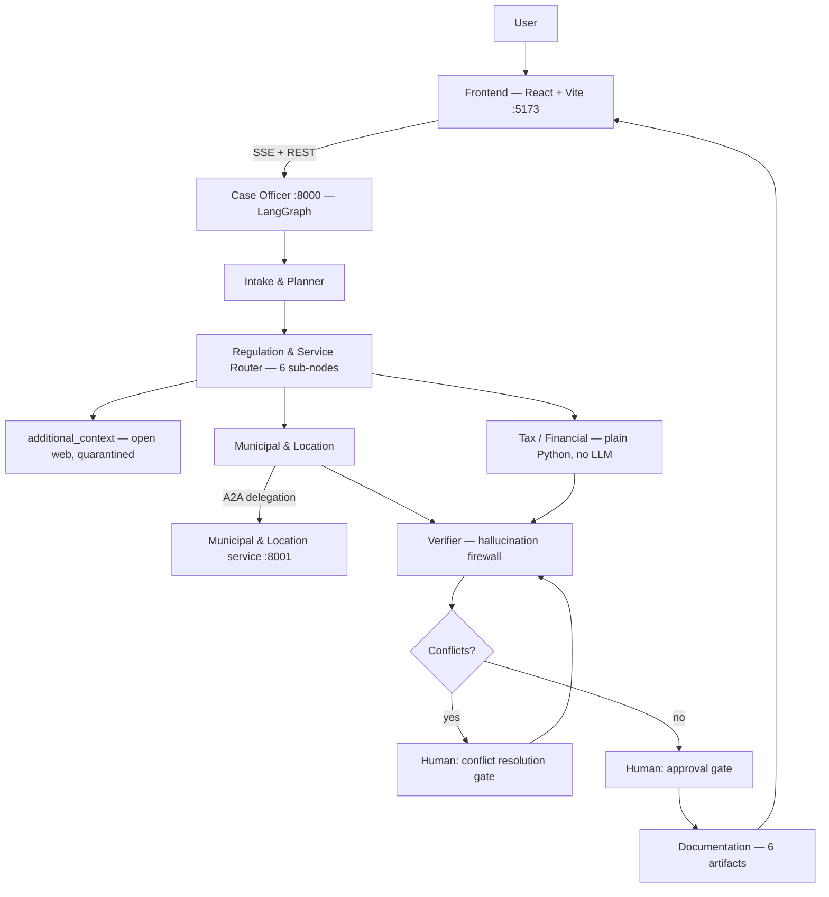

# Bosalah — بوصلة

**A multi-agent orchestrator for Saudi government business-setup procedures.**

Bosalah takes one sentence — *"I want to open a specialty coffee shop in Al-Olaya,
Riyadh"* — and returns a verified, cited, step-by-step government journey: which
agencies apply, what each requires, what it costs, and a draft application packet.

Its defining constraint is not capability but **honesty**. Every factual claim
must trace to a named government page, or it does not appear in the output at
all.

---

## Table of contents

- [The problem](#the-problem)
- [The solution](#the-solution)
- [Solution or agent design](#solution-or-agent-design)
- [Why this is hard: the hallucination problem](#why-this-is-hard-the-hallucination-problem)
- [System architecture](#system-architecture)
- [Architecture diagram](#architecture-diagram)
- [The agent hierarchy](#the-agent-hierarchy)
- [How the agent works](#how-the-agent-works)
- [Agent reference](#agent-reference)
- [Model assignment per node](#model-assignment-per-node)
- [The retrieval architecture](#the-retrieval-architecture)
- [Human-in-the-loop gates](#human-in-the-loop-gates)
- [The frontend](#the-frontend)
- [Repository layout](#repository-layout)
- [Agent stack](#agent-stack)
- [How to run](#how-to-run)
- [Usage](#usage)
- [Example output](#example-output)
- [Verifying the backend is connected to the frontend](#verifying-the-backend-is-connected-to-the-frontend)
- [Testing](#testing)
- [Known limitations](#known-limitations)
- [Demo](#demo)
- [Future work](#future-work)
- [Team](#team)
- [Course information](#course-information)

---

## The problem

Starting a business in Saudi Arabia means dealing with a set of agencies that
each own one slice of the process, and none of which owns the whole picture:

| Agency | Owns |
|---|---|
| Saudi Business Center / Ministry of Commerce | Commercial Registration (CR) |
| Balady (Ministry of Municipalities & Housing) | Municipal activity licence |
| ZATCA | VAT registration and thresholds |
| SFDA | Food safety |
| GOSI / Qiwa / HRSD | Employer registration, social insurance, payroll |
| SAIP | Trademarks |

An applicant faces three concrete difficulties:

1. **Discovery.** There is no single place that says "for *your* business, in
   *your* city, here is the complete list." You find out about a requirement
   when something else is blocked by it.
2. **Sequencing.** The steps have dependencies — a municipal licence generally
   presupposes a commercial registration — but the dependency graph is not
   published anywhere as a graph.
3. **Trust.** The most accessible answers come from consultancy blogs and forum
   posts. They read authoritatively, they are often out of date, and they are
   not accountable for being wrong.

The obvious fix — "ask a chatbot" — makes problem 3 *worse*. A general assistant
will answer confidently about Saudi licence fees and VAT thresholds from
training data that is stale, and will not tell you which parts it is unsure of.
In a government-facing tool, a confident wrong number is more damaging than no
answer.

## The solution

Bosalah is a **multi-agent system that is architecturally prevented from
answering from memory**. Six specialised agents, each with a narrow scope and a
locked-down source list, work a case and hand it to a seventh — a Verifier —
that audits every claim before the user sees it.

Three design commitments distinguish it from a chatbot wrapper:

**1. Sources are enforced by tooling, not by prompting.** Search is executed
through a client hard-configured with `include_domains` locked to a verified
allowlist of Saudi government domains. The tool *cannot* return a consultancy
blog. The prompt rule telling agents not to cite one is defence in depth, not
the defence.

**2. Certainty is computed, not generated.** Where an answer is arithmetic — is
this business above the VAT registration threshold? — it is plain Python with
no model in the decision path. A model that paraphrases "exceeds SAR 375,000"
into "around SAR 375,000" has produced a wrong answer to a question with an
exact answer.

**3. Not knowing is a first-class outcome.** When retrieval returns nothing from
an allowed domain, the requirement is marked `unverified — no allowlisted source
found`. There is no code path where an empty retrieval produces a cited claim,
because the "no sources" branch never reaches a model at all.

---

## Solution or agent design

What the system receives, what the agent does, and what it produces:

```text
User submits a one-sentence goal + structured intake fields
                    ↓
        Intake & Planner extracts structured case data
                    ↓
   Regulation Router retrieves requirements from allowlisted
              government sources only
                    ↓
   Municipal & Location (A2A) and Tax / Financial (deterministic
              Python) run in parallel
                    ↓
   Verifier audits every claim; unresolved conflicts trigger a
              human-in-the-loop decision
                    ↓
   Documentation agent assembles six artifacts from only the
              claims the Verifier accepted
                    ↓
User receives a cited, step-by-step government journey — Journey,
Checklist, Evidence Report, Fee Estimate, Application Packet, Decision Log
```

No claim reaches the last step unless it survived retrieval from an
allowlisted domain **and** the Verifier's audit — see
[Why this is hard](#why-this-is-hard-the-hallucination-problem) for how that's
enforced in code, not just in the prompt.

---

## Why this is hard: the hallucination problem

The central engineering problem is that a language model asked a factual
question will almost always produce an answer. The system is built to make that
impossible in the places it matters.

**Layer 1 — Tool-level domain lock.** Every search is scoped to an allowlist of
18 domains (16 citable, 2 semi-official), each verified against its live site.

**Layer 2 — Prompt-level rules.** Each retrieval node's system prompt forbids
answering from training knowledge, requires a URL and timestamp on every claim,
and forbids `HIGH` confidence on anything inferred rather than stated.

**Layer 3 — Structural enforcement in code.** A model's output is not trusted to
follow its own prompt:

- A claim citing a URL the node did not actually retrieve is **dropped**.
- `source_entity` and the confidence ceiling come from the allowlist, not from
  the model.
- Evidence carrying a non-allowlisted `source_url` **fails Pydantic validation
  at construction**, so it cannot exist in memory.
- Semi-official domains are capped at `MEDIUM` confidence by a function, no
  matter what the model claims.

**Layer 4 — The Verifier.** A separate agent re-audits everything. Its
deterministic checks run first and are not delegated: a blank URL, an
off-allowlist URL, or **a numeric claim whose figure does not appear in the
cited passage** are all rejected in code before a model is consulted.

That last rule exists because of a real trap found while building the corpus.
The ZATCA *VAT Implementing Regulations* — a 162,000-character official PDF, the
most authoritative-looking document in the entire corpus — refers to "the
Mandatory Registration Threshold detailed in the Agreement" and **never states
the number**. An agent citing it for "SAR 375,000" would be fabricating while
appearing maximally rigorous. A test now asserts that document does *not* contain
the figure, so the trap cannot silently reopen.

**Layer 5 — Honest failure reporting.** If the Verifier's audit cannot run —
say the model provider returns HTTP 429 — the claims are withheld, but the
decision log says so in unmistakable terms:

```
*** VERIFICATION INCOMPLETE — the audit model was unavailable (rate limited).
    12 of 13 claim(s) were NOT audited and are withheld.
    This is a system failure, NOT a finding that the claims were unsourced. ***
```

"Verification could not run" and "verification found nothing" produce identical
numbers and mean opposite things. Conflating them is the worst failure this
system could have, so it is called out explicitly.

**Two different failures were once conflated, too.** The free OpenRouter tier
turned out to cap at 50 requests **per day**, not per minute. Early code
treated a daily cap the same as a per-minute throttle — every node slept 90
seconds and retried against the same exhausted, account-wide allowance, so a
run took ten minutes to fail instead of failing fast. A daily-cap rejection now
fails immediately with the reset time and the remedy; a genuine per-minute
throttle still backs off and retries as before.

**The response cache is verified to never replay a failure as a success.** The
cache write sits strictly between a successful parse and the return — any
exception skips it, and there is no other call site that writes to it. Tests
pin this directly: a 429, a timeout, and malformed JSON each write nothing to
the cache; a 429 followed later by a success stores only the success. Every
live cache entry was audited by hand at least once to confirm none contain an
error payload.

---

## System architecture

Two independently deployable backend services plus a React frontend:

```
┌───────────────────────────────┐        ┌──────────────────────────────┐
│   Frontend (React + Vite)     │        │  Municipal & Location        │
│   :5173                       │        │  A2A microservice  :8001     │
│                               │        │                              │
│   • Intake form               │        │  • Balady requirements       │
│   • Live agent roster (SSE)   │        │  • OSM competitor lookup     │
│   • Conflict / approval gates │        │  • /.well-known/             │
│   • Journey + evidence panels │        │      agent-card.json         │
└──────────────┬────────────────┘        └───────────▲──────────────────┘
               │ SSE + REST                          │ A2A delegation
               ▼                                     │ (card-discovered)
┌──────────────────────────────────────────────────┴─────────────────────┐
│  Case Officer  :8000                                                    │
│                                                                          │
│  LangGraph StateGraph ─ intake → regulation → [municipal ∥ tax]         │
│                       → verifier → gates → documentation                │
│                                                                          │
│  Tools: Tavily (allowlisted), local corpus (hybrid BM25 + dense),       │
│         PyMuPDF document extraction, FastMCP execution adapter          │
└──────────────────────────────────────────────────────────────────────────┘
```

**Why two services?** The Municipal agent is a genuinely separate concern with a
narrower source list, and running it as an independent A2A service makes that
boundary real rather than conventional. Its allowlist contains only
`balady.gov.sa` and `momah.gov.sa`, so even a prompt-injection inside the
municipal node cannot produce a ZATCA citation — the domain is not reachable
from that process.

### Architecture diagram



---

## The agent hierarchy

```
                            START
                              │
                              ▼
                    ┌───────────────────┐
                    │ Intake & Planner  │   extracts fields, picks branch
                    └─────────┬─────────┘
                              │ conditional edge on branch
                              ▼
                    ┌───────────────────────────────────┐
                    │   Regulation & Service Router     │
                    │   (fan-out over topic sub-nodes)  │
                    │                                    │
                    │   ├── commercial_registration      │
                    │   ├── vat_registration             │
                    │   ├── food_safety                  │
                    │   ├── employment_social_insurance  │
                    │   └── intellectual_property        │
                    └─────────┬─────────────────────────┘
                              │ parallel branches
                   ┌──────────┴──────────┐
                   ▼                     ▼
      ┌─────────────────────┐   ┌──────────────────┐
      │ Municipal & Location│   │  Tax / Financial │
      │   (A2A → :8001)     │   │  (pure Python)   │
      └──────────┬──────────┘   └────────┬─────────┘
                 └───────────┬───────────┘
                             ▼
                    ┌─────────────────┐
                    │    Verifier     │  ◄──────┐
                    └────────┬────────┘         │
                             │                   │
              conflicts?  ───┴───┐               │
                    yes │        │ no            │
                        ▼        │               │
           ┌────────────────────┐│               │
           │ HUMAN: conflict    ├┘───────────────┘
           │ resolution gate    │  loops back to re-audit
           └────────────────────┘
                        │
                        ▼
           ┌────────────────────┐
           │ HUMAN: approval    │
           │ gate               │
           └─────────┬──────────┘
                     ▼
           ┌────────────────────┐
           │   Documentation    │  six artifacts
           └─────────┬──────────┘
                     ▼
           ┌────────────────────┐
           │ MCP execution      │  auth-gated mock submission
           │ adapter (optional) │
           └────────────────────┘
                     ▼
                    END
```

The **Regulation Router is not one agent** — it is a fan-out over topic nodes,
each with its own system prompt and its own allowed-domain subset. This matters:
a single "Regulation Agent" prompt covering both Balady and ZATCA lets retrieved
VAT content leak into a municipal answer. Narrow scope per call reduces both
token usage and cross-contamination. The sub-nodes run concurrently, so the
wall-clock cost is the slowest node, not the sum.

**State is merged, never overwritten.** Each node returns a *partial update*
combined through explicit LangGraph reducers. `municipal_location` and
`tax_financial` run in parallel and both append to `requirements` and
`evidence_log`; without additive reducers one would silently erase the other's
findings.

---

## How the agent works

What it receives, what it decides, what tools it uses, what it produces:

```text
User Request (intake form + optional lease PDF)
     ↓
Case Officer (LangGraph StateGraph)
 ├── Intake & Planner       — extracts fields; no tools, no guessing
 ├── Regulation Router      — search_gov_sources (Tavily, domain-locked)
 │                            + local corpus hybrid search (BM25 + dense)
 ├── Municipal & Location   — delegates over A2A to an independent service
 ├── Tax / Financial        — deterministic Python, zero LLM in the decision
 ├── Verifier               — audits every claim; detects document conflicts
 └── Documentation          — assembles artifacts from accepted evidence only
     ↓
Human-in-the-loop gates (conflict resolution, then approval) — both are
LangGraph interrupt() pauses, not suggestions a model could skip
     ↓
Six Artifacts: Journey · Checklist · Evidence Report · Fee Estimate ·
Application Packet Draft · Decision Log
```

Every decision that touches a citation or a number is either grounded in a
retrieved, allowlisted source or computed in plain code — never generated from
the model's own training knowledge. See [Agent reference](#agent-reference) for
the tools, model, and hard rules behind each node.

---

## Agent reference

### 1. Intake & Planner

| | |
|---|---|
| **Role** | Turn a free-text goal into structured `CaseState` fields; choose the branch |
| **Tools** | None — pure extraction over the user's own words |
| **Model** | `nvidia/nemotron-nano-9b-v2:free` |
| **Output** | Field updates, `branch`, `missing_fields` |

The structured intake form already supplies most fields, so this agent only
reads the free-text goal for what the form did not capture. Its hard rule is
that it **must not guess**: an unstated city is listed in `missing_fields`, never
inferred. It is also forbidden from answering any regulatory question — that is
another agent's job, with evidence.

### 2. Regulation & Service Router *(six topic sub-nodes)*

| | |
|---|---|
| **Role** | Determine what each agency requires, grounded only in retrieved allowlisted pages |
| **Tools** | `search_gov_sources` (Tavily, `include_domains` locked), local corpus hybrid search |
| **Model** | `nvidia/nemotron-3-ultra-550b-a55b:free` on the five government-scoped sub-nodes |
| **Output** | `RequirementItem[]` + `Evidence[]` |

Every government-scoped sub-node gets the strongest available model because
citation discipline is where a weaker model fails first — by paraphrasing just
past what the source actually said.

Domain scope per sub-node:

| Sub-node | Domains |
|---|---|
| `commercial_registration` | business.sa, bc.gov.sa, mc.gov.sa |
| `vat_registration` | zatca.gov.sa |
| `food_safety` | sfda.gov.sa |
| `employment_social_insurance` | gosi.gov.sa, qiwa.sa, hrsd.gov.sa |
| `intellectual_property` | saip.gov.sa |

**The Router deliberately does not own `balady.gov.sa`.** Municipal requirements
belong to the A2A service; leaving Balady here would have two components
retrieving the same pages and double-reporting the licence.

**A sixth sub-node, `additional_context`, is architecturally different from the
other five.** It is the only retrieval node with **no government domain
allowlist** — it searches the open web so non-government sources (consultancy
guides, law-firm articles) can surface useful context an official page might
not phrase plainly. Because that context can be genuinely useful but is
categorically less trustworthy, its isolation from the verified pipeline is
enforced in code, not by convention:

- Its output lives in a separate field, `supplementary_context`, with **no code
  path** that can write to `requirements` or `evidence_log`.
- Its data type pins `confidence` to the literal `"LOW"` and `is_official` to
  `False` at the schema level — assigning anything else fails Pydantic
  validation at construction, so a wrong value cannot silently slip through.
- It can never move `readiness_pct`. A test stuffs a case with ten
  supplementary items and asserts readiness is unaffected.

Because there is no domain allowlist to lean on, scoping this node to Saudi
Arabia specifically required three independent layers rather than one:

1. The search query itself contains "Saudi Arabia", biasing the search engine
   before any model is involved.
2. A code-level keyword check drops any result with no mention of Saudi
   Arabia, KSA, the Kingdom, or a Saudi regulator — applied **twice**: once to
   raw search results, and again to the claim the model writes, since a model
   can summarise a Saudi page into a country-neutral sentence that would
   otherwise slip past the first check. (`"Kingdom"` deliberately does not
   match inside `"United Kingdom"` — a naive substring check would pass every
   UK government page on that word alone.)
3. The system prompt instructs the model to ignore other jurisdictions, as a
   final layer rather than the only one.

Tests prove the isolation with real non-Saudi pages (UAE, Egypt, UK) filtered
entirely in code, model switched off.

### 3. Municipal & Location *(separate A2A service, port 8001)*

| | |
|---|---|
| **Role** | Balady municipal requirements + location context |
| **Tools** | Balady-scoped search; `lookup_nearby_competitors` (OpenStreetMap Overpass + Nominatim) |
| **Model** | `nvidia/nemotron-3-super-120b-a12b:free` |
| **Discovery** | Case Officer fetches `/.well-known/agent-card.json` and calls the endpoint the card advertises |

Two guardrails are enforced in code rather than trusted to the prompt:

- The line **"Municipal approval status: NOT VERIFIED — approval can only be
  confirmed by Balady directly"** is appended by the service, so it is present
  even if the model omits it. The agent may never state or imply that a location
  has been approved.
- The competitor count is passed through from OpenStreetMap untouched and
  labelled **"AI ESTIMATE — competitor count only, not a suitability judgment."**
  No function exists in the module to convert it into a score or recommendation,
  so it cannot be done by mistake.

Geocoding is bounded to a per-city viewbox. Free-text geocoding once resolved
"Al-Olaya, Riyadh" to Al Olaya in *Al Quwayiyah*, ~160 km away, and reported zero
nearby competitors — a wrong location producing a confident number is worse than
an obvious failure. Candidates outside the box are now discarded, district
polygons are preferred over streets that share the name, and a weak match is
labelled so the count can be discounted.

**This node returned nothing for a while, and it turned out to be three
compounding bugs, not one:**

1. **The question was over-specific.** It asked what applies to *this*
   category, in *this* district, at *this* exact square-metre figure — the
   most granular binding of any node. Balady publishes requirements for
   commercial premises generally and never names a district or a sqm number,
   so a source failing to match all three read as a miss. The prompt now asks
   what Balady publishes for commercial premises and which of it governs the
   activity; case facts remain available for stating conditions in the note,
   never as a filter on what gets reported.
2. **The retrieved context was 183,000 characters.** Live Balady/momah pages
   are service directories — two measured over 52,000 characters each, mostly
   a catalogue of unrelated services (maps, panoramas, vehicle marking). The
   whole page was being sent whole, so the licence requirements were buried.
   Now windowed around the query: 183,299 → 9,579 characters, a 19× reduction
   — the same class of bug as the Verifier's passage-windowing fix, in the
   opposite direction (too much irrelevant content diluting the signal, rather
   than too little of the right content reaching it).
3. **This was the only model-calling node with no rate-limit handling at
   all.** A 429 surfaced identically to "Balady genuinely publishes nothing" —
   indistinguishable in the output. It now shares the same backoff schedule as
   the Case Officer.

Any one of these alone could produce a false "unverified" result; together
they meant the node's output could not be trusted until all three were found
and fixed. Real Balady requirements (establishment record, exterior signboard
photo, lease/ownership contract) now surface correctly.

### 4. Tax / Financial — **no model in the decision path**

| | |
|---|---|
| **Role** | VAT threshold comparison |
| **Tools** | None. Plain Python |
| **Model** | None for the decision; `nemotron-nano-9b-v2` only rephrases the result |

```python
VAT_MANDATORY_THRESHOLD_SAR = 375_000   # verified against zatca.gov.sa
VAT_VOLUNTARY_THRESHOLD_SAR = 187_500   # verified against zatca.gov.sa
```

This is the clearest statement of the project's thesis: **agents where reasoning
is required, code where certainty is required.** A test asserts the module's
source contains no LLM client import at all.

The comparison is strictly greater-than because the source says *exceed*:
"annual revenues exceed SAR 375,000". Revenue landing exactly on the threshold
does **not** cross it — a boundary taken from the source's wording, not a coding
convention. A test asserts the corpus still contains the literal string
`exceed SAR 375,000`, so if ZATCA rewords it to "or more", the off-by-one
surfaces instead of silently producing a wrong answer.

Missing revenue returns `unknown_revenue_not_provided`, never a default of zero —
absent data is not the same as a small business.

### 5. Verifier — the hallucination firewall

| | |
|---|---|
| **Role** | Audit every claim; detect document discrepancies |
| **Tools** | None — it reads what other agents produced |
| **Model** | `nvidia/nemotron-3-ultra-550b-a55b:free`, temperature 0, falls back to Super under contention |

Deterministic checks run first and are decided in code: blank URL,
off-allowlist URL, or a numeric claim whose figure is absent from the cited
passage. Only claims surviving those reach a model, so a model failure can never
turn a structurally invalid claim into an accepted one.

For long sources the Verifier is shown **the region of the passage bearing on
the claim**, scored by term frequency, adjacent-word-pair matches, and exact
numerals. Live passages reach 130,000 characters; handing over the first 900
would show it a cover page and cause it to reject well-supported claims.

The audit runs in **batches of four**, so a rate limit costs a few claims rather
than every verdict.

**Discrepancy detection.** If the stated premises area and the area extracted
from an uploaded lease differ *by any amount*, the Verifier does not pick one.
It emits a structured conflict, freezes readiness, and requires a human decision.

### 6. Documentation / Packaging

| | |
|---|---|
| **Role** | Assemble the six final artifacts |
| **Model** | `nvidia/nemotron-3-nano-30b-a3b:free` (summary prose only) |

Produces, in order: **Journey, Checklist, Evidence Report, Fee Estimate,
Application Packet Draft, Decision Log.**

Rule 1 — "never re-introduce a rejected claim" — is enforced structurally by
building artifacts from the accepted-evidence list, not by asking a model to
remember what was rejected. Every unsourced number carries **"AI ESTIMATE — not
an official fee."** The evidence report deliberately shows rejected rows *with
their rejection reason*: the Verifier's work is only legible if you can see what
it threw away.

### 7. MCP execution adapter — auth-gated mock submission

The only component with side-effect semantics, so it is the one with an auth
gate (`MCP_AUTH_SECRET`, self-issued, constant-time compared). It refuses to
submit a case that has not passed the approval gate or that has an unresolved
discrepancy. It contacts nothing: it returns a synthetic reference clearly
marked `MOCK-BLD-…` with a notice that no application was filed. A demo that
appeared to file a real government application would be worse than one that
plainly does not.

---

## Model assignment per node

Match the model to what the node needs; do not put the largest model everywhere.
All slugs re-verified against `openrouter.ai/api/v1/models`. **Temperature 0
everywhere** — every node touches a citation or a numeric claim, and creative
variance has no place in a system whose value proposition is not hallucinating.

| Node | Model | Fallback | Why |
|---|---|---|---|
| `intake_planner` | nemotron-nano-9b-v2 | — | Field extraction, not deep reasoning |
| `commercial_registration` | **nemotron-3-ultra-550b** | super-120b | Citation discipline is make-or-break |
| `vat_registration` | **nemotron-3-ultra-550b** | super-120b | Numeric thresholds — highest-risk claim |
| `food_safety` | **nemotron-3-ultra-550b** | super-120b | Must resist manufacture→food-service analogy |
| `employment_social_insurance` | **nemotron-3-ultra-550b** | super-120b | Multi-domain; can meet a semi-official source |
| `intellectual_property` | **nemotron-3-ultra-550b** | super-120b | Must not present optional as mandatory |
| `municipal_requirements` | nemotron-3-super-120b | — | Narrow, well-scoped remote agent |
| `competitor_lookup` | nemotron-3-super-120b | — | Restates a tool result |
| `verifier` | **nemotron-3-ultra-550b** | super-120b | The firewall; runs once per case |
| `documentation` | nemotron-3-nano-30b | — | Templating-heavy, light reasoning |
| `tax_explanation` | nemotron-nano-9b-v2 | — | Rephrases a decided dict; **not** the decision |
| **`tax_financial`** | **none — plain Python** | — | Certainty belongs in code |
| embeddings | nemotron-3-embed-1b (2048-dim) | bge-m3 | Dense half of hybrid search |

`GET /api/models` returns this table live. Override any node with
`MODEL_<NODE_NAME>=…` in the environment.

The Verifier's Ultra→Super fallback is the documented contention plan: it runs
once per case, so it is the node to downgrade first when quota is tight.

---

## The retrieval architecture

**Live-first, corpus-fallback, then honest silence.**

1. **Live Tavily search**, scoped to the node's allowed domains (12s timeout, no
   retry — the fallback *is* the retry).
2. On timeout, error, empty result, or results yielding no evidence at `MEDIUM`
   or better → **hybrid search over the local corpus** (BM25 + optional dense
   embeddings, fused with Reciprocal Rank Fusion), scoped to the same domains.
3. If both come up empty → the requirement is marked `unverified — no
   allowlisted source found`, **without a model call at all**.

Which path served each answer is recorded on every `Evidence` object
(`retrieval_path`) and in the decision log, so a demo can show "this came from a
live lookup; this came from the pre-verified corpus."

**The corpus** is 16 government pages (~258,000 characters) collected in Phase 0,
stored as markdown with YAML frontmatter carrying provenance — source URL,
entity, retrieval timestamp. The loader refuses any document whose `source_url`
is off-allowlist: a corpus file pointing somewhere unlisted is a build error, not
something to quietly retrieve and cite.

BM25 is implemented in-project so the tokeniser can do Arabic normalisation —
folding alef variants, teh marbuta, and diacritics. The corpus is bilingual, and
an un-normalised Arabic token (`الأنشطة` vs `الانشطة`) simply never matches.

**Two caches, both on disk, both deliberate:**

| Cache | Purpose |
|---|---|
| `data/.tavily_cache/` | Repeat searches don't re-hit Tavily; a cached result can rescue a demo |
| `data/.llm_cache/` | Keyed by (node, model, prompt). Safe because every node is temperature 0 |

Neither expires. A stale-but-real cached answer is more useful than a failed
lookup, and every entry records when it was fetched. **Failed calls are never
cached**, so a broken run cannot become reproducible.

---

## Human-in-the-loop gates

Both use LangGraph's `interrupt()` — the graph genuinely pauses mid-execution
rather than polling.

**Gate 1 — Conflict resolution.** Fires when the stated area and the
document-extracted area disagree. Both values are shown with their sources and
**no option is preselected**. Readiness is frozen until a human chooses; the
graph then loops back so the Verifier re-audits with the accepted value.

**Gate 2 — Approval.** Before artifacts are generated, showing requirement count
and accepted/rejected evidence counts. Rejecting ends the run without producing
a packet.

---

## The frontend

React 18 + Vite + Tailwind, dark theme, on port **5173**.

**The Agent Activity panel is live.** It is driven by `agent_status` events over
Server-Sent Events — roughly 18 per run — not by polling and not by a canned
sequence. Each of the six agents moves through *Waiting → Working… → Completed*
(or *Error*, which is how the Verifier renders while blocked on a discrepancy),
with the message text coming from the backend: `Branch: food_business`,
`11 requirements cited, 0 unverified`, `Delegated over A2A to :8001`,
`Approval status: NOT VERIFIED`, `Discrepancy — awaiting human resolution`.

The roster badge shows the *kind* of node — `LLM`, `A2A`, `DETERMINISTIC` — which
makes the architecture legible during a demo. It does **not** currently display
which model each node runs on; that mapping lives at `GET /api/models`.

Because a first run genuinely takes minutes, the UI shows an elapsed timer and
sets expectations rather than implying a snappy response.

**Results are presented in three sections**, replacing an earlier "Journey
Roadmap" and a generic filterable evidence panel that had no real relationship
to case state:

- **"Regulations found"** — one card per agency (Ministry of Commerce,
  Municipalities & Housing, SFDA, ZATCA, GOSI…), grouped by the entity the
  *allowlist* assigns, never by anything a model produced. Each row shows the
  requirement, a `VERIFIED` / `REQUIRED` / `UNVERIFIED` chip, the reason, a
  retrieval-path badge (`Live` or `Corpus`), and a source link.
- **"Non-government sources"** — sits inside the same section as the agency
  cards but is deliberately muted grey with a dashed border and no glow, so it
  can never be mistaken for one at a glance. Carries the `additional_context`
  node's output: real source domain, a `LOW` badge, and the subtitle *"Not
  verified against an official government source — for reference only."* No
  verified/satisfied language appears anywhere in it.
- **"Your Path"** — two columns, Completed and Missing, computed from
  `requirement.status` rather than from citation presence alone: a requirement
  only reads Completed once there is both an accepted citation *and* the
  case's own data actually satisfies it (e.g. stated applicant age against a
  stated minimum), not merely because nothing contradicts it. `unverified`
  requirements appear in Missing, in amber, explicitly distinct from a red
  action state — "we could not verify this" is an honest system state, not a
  failure.

Four bugs found during frontend testing, worth knowing if they resurface:
the Audit Log's "Invalid Date" traced to the frontend double-formatting an
already-formatted timestamp before passing it to a date parser, not a backend
timestamp gap; the Audit Log's apparent fade at the top and bottom of the list
was a clipped fixed-height container, not a mask, now scrollable; the
submission-confirmation modal once rendered a string character-by-character as
a numbered list because it was passed a plain string instead of the key/value
object it expects (now type-enforced at compile time); and a blank,
unrecoverable screen after confirming submission meant React had unmounted the
entire app — two error boundaries now contain that failure, one around the
submission modal with its close controls rendered *outside* the boundary so a
display fault can never trap the user again, and one at the app root.

---

## Repository layout

```
Sdaia_capstone_project/
├── backend/
│   ├── case-officer/                 main graph service (:8000)
│   │   ├── app/
│   │   │   ├── main.py               FastAPI + SSE endpoints
│   │   │   ├── graph.py              LangGraph wiring, reducers, interrupts
│   │   │   ├── state.py              CaseState / Evidence / RequirementItem
│   │   │   ├── llm.py                model assignment, 429 backoff, JSON repair
│   │   │   ├── agents/               prompts + the five agents
│   │   │   ├── tools/                retrieval, search, corpus, caches, A2A, PDF
│   │   │   ├── mcp/                  agent cards, auth-gated execution adapter
│   │   │   └── config/               allowlist, category map, settings
│   │   ├── scripts/collect_corpus.py Phase 0 corpus collector
│   │   └── tests/                    343 tests
│   └── municipal-location/           A2A microservice (:8001), 48 tests
├── frontend/                         React + Vite (:5173)
│   └── src/
│       ├── api/caseStream.ts         the only file that touches the network
│       ├── types/caseState.ts        mirror of the backend Pydantic schema
│       ├── lib/adapters.ts           UI ↔ backend vocabulary reconciliation
│       └── components/
├── data/gov_corpus/                  16 government pages with provenance
└── docs/                             implementation plan + handoff
```

---

## Agent stack

```text
LLM:
OpenRouter (Nemotron model family — nano-9b, super-120b, ultra-550b, embed-1b)

Agent Framework:
LangGraph (StateGraph, explicit reducers, interrupt() for human-in-the-loop gates)

Agent Protocol:
A2A (Agent Card discovery + delegation, Municipal & Location service)

API:
FastAPI (Case Officer :8000, Municipal & Location :8001), Server-Sent Events for live agent status

Tools:
Tavily (allowlisted web search), FastMCP (auth-gated execution adapter), PyMuPDF (lease PDF extraction)

Retrieval:
Hybrid BM25 + dense embeddings (Reciprocal Rank Fusion) over a 16-page verified government corpus

Observability:
LangSmith (optional, full run tracing)

Frontend:
React 18 + Vite + Tailwind
```

Why these choices: search is Tavily specifically because it supports
`include_domains`, which is the actual anti-hallucination enforcement point —
not a general-purpose search API. Tax/VAT logic deliberately has **no LLM in
the decision path** — see [Agent reference](#agent-reference) for why.

---

## How to run

### Prerequisites

| Tool | Purpose |
|---|---|
| [uv](https://docs.astral.sh/uv/) | Python dependency management |
| Node.js 18+ | Frontend |
| An [OpenRouter](https://openrouter.ai) API key | LLM model calls |
| A [Tavily](https://tavily.com) API key | Allowlisted government-source search |
| *(optional)* LangSmith API key | Run tracing and observability |

### 1. Clone the repository

```bash
git clone <repository-url>
cd Sdaia_capstone_project


**1. Configure secrets.** Three `.env` files, one per service — each service gets
only the secrets it needs:

```bash
cp backend/case-officer/.env.example       backend/case-officer/.env
cp backend/municipal-location/.env.example backend/municipal-location/.env
cp frontend/.env.example                   frontend/.env
```

Fill in `backend/case-officer/.env`:

```ini
OPENROUTER_API_KEY=sk-or-v1-...
TAVILY_API_KEY=tvly-...
LANGSMITH_API_KEY=lsv2_pt_...      # optional
LANGSMITH_TRACING=true
LANGSMITH_PROJECT=govflow-ksa
MCP_AUTH_SECRET=<openssl rand -hex 32>
```

Fill in `backend/municipal-location/.env` — it needs only two:

```ini
OPENROUTER_API_KEY=sk-or-v1-...
TAVILY_API_KEY=tvly-...
```

`frontend/.env` points the browser at the API:

```ini
VITE_API_BASE_URL=http://localhost:8000
VITE_MCP_AUTH_TOKEN=<same value as MCP_AUTH_SECRET>
```

> `VITE_MCP_AUTH_TOKEN` is a **demo shortcut** so the submission button works.
> A browser bundle should never hold a server secret; a real deployment would
> gate `/submit` by session server-side.

**2. Install dependencies.**

```bash
(cd backend/case-officer       && uv sync)
(cd backend/municipal-location && uv sync)
(cd frontend                   && npm install)
```

**3. Start all three, in three terminals.** Order matters only in that the
Case Officer expects the municipal service to be reachable when it delegates.

```bash
# Terminal 1 — Municipal & Location A2A service
cd backend/municipal-location && uv run uvicorn app.main:app --port 8001

# Terminal 2 — Case Officer
cd backend/case-officer && uv run uvicorn app.main:app --port 8000

# Terminal 3 — Frontend
cd frontend && npm run dev
```

Open **http://localhost:5173**.

> All three services can also be started in the background from the repository
> root once dependencies are installed:
> ```bash
> (cd backend/municipal-location && uv run uvicorn app.main:app --port 8001 &)
> (cd backend/case-officer       && uv run uvicorn app.main:app --port 8000 &)
> (cd frontend                   && npm run dev)
> ```

### Expect a long first run

The free Nemotron tier **queues roughly 60–70 seconds per call**, even for a
trivial prompt. A case makes about seven.

| Run | Duration |
|---|---|
| Cold (empty caches) | up to ~7 minutes |
| Warm (same case again) | ~80–95 seconds |

**If you are recording a demo, do a full warm-up run first**, confirm it completed
cleanly, then record the replay. Check `GET /health` → `llm_cache.entries` to
confirm the cache is primed. Failed calls are not cached, so if a warm-up gets
rate-limited part-way, run it again before recording.

**The free OpenRouter tier caps at 50 model requests per day** (not per
minute), resetting at 00:00 UTC — roughly seven full cases. The backend
distinguishes the two failure modes rather than treating them the same: a
per-minute throttle backs off and retries (5s → 20s → 65s); a daily-cap
rejection fails **immediately** with a message naming the reset time, instead
of the old behaviour of sleeping 90 seconds per node and burning ten minutes to
fail anyway. Adding a small amount of credit (~$10) raises the daily cap to
roughly 1,000/day and is the single easiest way to avoid running out mid-demo.

### Useful environment switches

| Variable | Effect |
|---|---|
| `DISABLE_LIVE_SEARCH=1` | Corpus fallback only; cached live results still serve |
| `DISABLE_LLM_CACHE=1` | Always call the model |
| `DISABLE_DENSE_SEARCH=1` | BM25-only hybrid search |
| `LIVE_SEARCH_TIMEOUT_SECONDS` | Default 12 |
| `LLM_TIMEOUT_SECONDS` | Default 240 |
| `A2A_CALL_TIMEOUT_SECONDS` | Default 300 |
| `MODEL_<NODE>` | Override one node's model |

### Rebuilding the corpus

```bash
cd backend/case-officer && uv run python scripts/collect_corpus.py
```

Re-fetches all 16 pages and rewrites `data/gov_corpus/` with fresh provenance
timestamps. Only allowlisted URLs are permitted; the script refuses anything else.

---

## Usage

Once all three services are running (see [How to run](#how-to-run)):

1. Open http://localhost:5173 and fill in the intake form — goal, category,
   city, district, applicant status, area, and expected annual revenue.
2. Optionally upload a lease PDF whose stated area differs from what you
   typed, to see the discrepancy-detection gate fire. The backend parses it
   with PyMuPDF and shows the extracted area.
3. Click **Analyse My Case** and watch the agent roster update live.
4. Resolve any conflict, approve at the gate, and the six artifacts render.

Or drive it directly via the API:

```bash
curl -s localhost:8000/api/cases -H 'Content-Type: application/json' \
  -d '{"intake":{"goal":"open a coffee shop","business_category":"food_beverage_fixed",
       "city":"Riyadh","district":"Al-Olaya","applicant_status":"saudi_national",
       "area_sqm_stated":120,"expected_annual_revenue_sar":450000}}'
```

This returns a `case_id` — stream its progress with:

```bash
curl -N localhost:8000/api/cases/<case_id>/stream
```

---

## Example output

<!-- Add 3–4 screenshots here: the intake form, the live Agent Activity roster
     mid-run, the conflict-resolution modal (lease vs. stated area), and the
     final artifact view (Journey / Evidence Report). Save images under
     assets/ and reference them below. -->

### Live agent roster


### Conflict resolution gate


### Evidence report

Each accepted requirement lists its source entity, URL, and retrieval
timestamp; rejected claims are shown too, with their rejection reason — the
Verifier's work is only legible if you can see what it threw away.

---

## Verifying the backend is connected to the frontend

Work down this list — each step isolates one link in the chain.

**1. Are both backends alive?**

```bash
curl -s localhost:8000/health | python3 -m json.tool
curl -s localhost:8001/health | python3 -m json.tool
```

The Case Officer should report `"status": "ok"`, `"llm_available": true`, and a
corpus of 16 documents. If `llm_available` is `false`, `OPENROUTER_API_KEY` is
missing or still a placeholder.

**2. Is A2A discovery working?**

```bash
curl -s localhost:8001/.well-known/agent-card.json | python3 -m json.tool
```

Should advertise the `municipal_requirements` and `competitor_lookup` skills. The
Case Officer reads this card to find the endpoint — if it 404s, delegation
degrades to `unverified` rather than failing loudly.

**3. Is the frontend on the right port?** It **must** be 5173 — the backend's
CORS allowlist names it explicitly. `vite.config.ts` sets `strictPort: true`, so
if 5173 is occupied Vite will refuse to start rather than silently move to 5174
and produce opaque CORS errors. If it refuses, free the port:

```bash
lsof -ti:5173 | xargs kill
```

**4. Is the browser reaching the API?** Open DevTools → Network and submit a
case. You should see `POST /api/cases` → 200, then a long-lived
`GET /api/cases/{id}/stream` in `eventsource` type. If the POST fails with a CORS
error, check `VITE_API_BASE_URL` in `frontend/.env` is exactly
`http://localhost:8000`.

**5. Is the stream actually flowing?** Watch it directly:

```bash
CASE=$(curl -s localhost:8000/api/cases -H 'Content-Type: application/json' \
  -d '{"intake":{"goal":"open a coffee shop","business_category":"food_beverage_fixed",
       "city":"Riyadh","district":"Al-Olaya","applicant_status":"saudi_national",
       "area_sqm_stated":120,"expected_annual_revenue_sar":450000}}' | python3 -c 'import json,sys;print(json.load(sys.stdin)["case_id"])')
curl -N localhost:8000/api/cases/$CASE/stream
```

You should see `agent_status`, `state_patch` and `decision` frames, plus
`: keepalive` comments during long model calls. Those keepalives exist so
browsers and proxies don't treat a quiet minute as a dead connection.

**6. Exercise the deterministic core without any model:**

```bash
curl -s localhost:8000/api/debug/tax -H 'Content-Type: application/json' \
  -d '{"expected_annual_revenue_sar": 450000}' | python3 -m json.tool
```

**7. See which retrieval path a node would take:**

```bash
curl -s localhost:8000/api/debug/retrieve -H 'Content-Type: application/json' \
  -d '{"query":"mandatory VAT registration threshold","node":"vat_registration"}' \
  | python3 -m json.tool
```

### Common problems

| Symptom | Cause |
|---|---|
| UI stuck on "Waiting" for every agent | Case Officer not running, or wrong `VITE_API_BASE_URL` |
| CORS error in console | Frontend not on 5173 |
| Municipal agent always `unverified` | Service on 8001 not running |
| Everything `no allowlisted source found` | `TAVILY_API_KEY` missing → falls back to corpus; check `/health` |
| `*** VERIFICATION INCOMPLETE ***` | Rate limited. Wait, then re-run — this is the system reporting honestly, not a crash |
| Run takes >7 minutes | Normal on a cold cache under free-tier queueing |

---

## Testing

```bash
(cd backend/case-officer       && uv run pytest -q)   # 343 tests
(cd backend/municipal-location && uv run pytest -q)   # 48 tests
(cd backend/municipal-location && uv run pytest -m live -q)  # 5 live geocoding
(cd frontend && npm run build)
```

**391 backend tests.** The suite runs **offline by default** — live search and embeddings
are disabled in `conftest.py` so results are deterministic whether or not real
keys are present.

The tests worth knowing about lock in findings that were discovered by running
the system, not by reasoning about it:

- The VAT Implementing Regulations do **not** contain `375,000` — the
  hallucination trap stays closed.
- The corpus still contains the literal `exceed SAR 375,000`, justifying the
  strict greater-than boundary.
- A rate-limited audit reads as a system failure, never as a finding.
- `evilbalady.gov.sa`, `balady.gov.sa.attacker.com` and
  `https://balady.gov.sa@evil.com/` are all rejected by the allowlist.
- Passage windowing finds phrases buried deep in real 162k-character documents,
  and separately, in real 183k-character Balady/momah service-directory pages.
- `additional_context` items can never appear in accepted evidence or move
  `readiness_pct`, even when a case is stuffed with ten of them.
- Real non-Saudi pages (UAE, Egypt, UK) are filtered out of
  `additional_context` results by the code-level check alone, model switched
  off — including the `"Kingdom"` / `"United Kingdom"` false-positive case.
- The response cache never stores a 429, a timeout, or malformed JSON as if it
  were a successful answer.
- A daily rate-limit rejection and a per-minute throttle are distinguished and
  handled differently — the former fails immediately, the latter backs off.

---

## Known limitations

Stated plainly, because a government-facing tool that overstates itself is the
thing this project is arguing against.

1. **Two verticals are tested end to end** — fixed food & beverage and mobile
   food truck. The architecture generalises via `category_map.py`, but the other
   categories have not been validated.
2. **Only Riyadh has a built corpus.** Other cities fall back to live search
   alone.
3. **SFDA has no corpus document.** Its e-service pages are client-rendered and
   yield no text. Food safety is live-search-only; if Tavily is unavailable that
   requirement correctly reports `unverified`.
4. **Free-tier quota is the dominant practical constraint** — 50 model requests
   per day, resetting 00:00 UTC, roughly seven full cases. A cold case takes up
   to ~7 minutes; a repeat of the same case ~90 seconds from cache.
5. **The lease-discrepancy resolution is not yet recorded as its own citable
   evidence item** tagged `document`, so the Document category in "Regulations
   found" currently stays empty even after a conflict is resolved.
6. **For the food & beverage vertical, only 5 of the 6 Regulation Router nodes
   run** — `intellectual_property` is scoped to professional-office cases by
   design, not a gap.
7. **No minor-applicant pathway.** If an applicant states an age under 18 the
   system declines to proceed and points at an official source rather than
   inventing a process.
8. **Geocoding is approximate.** OSM often has only streets, not district
   polygons, for Riyadh districts; weak matches are labelled so the competitor
   count can be discounted.
9. **The execution adapter is a mock.** Nothing is ever filed with any agency.
10. **`MemorySaver` checkpointing** — a case does not survive a backend restart.
11. **The frontend renders four of the six artifacts.** Journey, evidence report,
    audit log and packet gate are wired; the checklist and fee estimate are
    fetched and held in state but have no component yet.
12. **The submission auth token currently sits in the frontend `.env`** as a
    demo shortcut (`VITE_MCP_AUTH_TOKEN`) — a real deployment would gate
    submission server-side, never in a browser bundle.
13. **Not legal advice.** Every output is a research aid pointing at official
    sources, and says so.

---

## Demo

Presentation deck: `docs/Bosalah_Capstone.pptx`

<!-- If you record a walkthrough video, add the link here:
Demo: https://youtube.com/... -->

---

## Future work

- Extend `category_map.py` beyond the two tested verticals (food & beverage,
  food truck) and validate each new category end to end rather than assuming
  the architecture generalises untested.
- Build a corpus for cities beyond Riyadh so live search isn't the only path
  outside the capital.
- Wire the two remaining artifacts (checklist, fee estimate) to frontend
  components — they're already computed and held in state.
- Replace `MemorySaver` with persistent checkpointing so a case survives a
  backend restart.
- Resolve an SFDA corpus source once a text-extractable page is available, so
  food safety isn't live-search-only.

---

## Team

| Member | GitHub | Contribution |
|---|---|---|
| Tala Alothaim | [@talaafahad](https://github.com/talaafahad) | Backend, Testing |
| Sadeem Alnassar | [@ksadeem992-art](https://github.com/ksadeem992-art) | Data, Testing |
| Raghad Alotaibi | [@RaghadAlotaibi00](https://github.com/RaghadAlotaibi00) | Frontend, Testing |

---

## Course information

Built as the capstone project for **Advanced Agentic AI Systems Engineering**
(هندسة أنظمة الذكاء الاصطناعي الوكيلي المتقدمة), SDAIA Academy, August 2026.

SDAIA Academy: https://github.com/SDAIAAcademy

---
